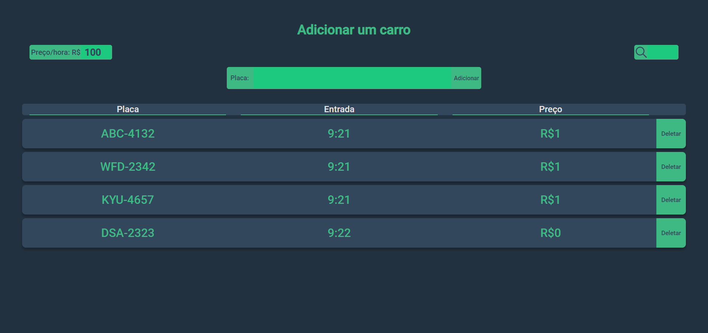

# Parking Management Software

This is a parking management software built with [Vue.js](https://vuejs.org) that calculates time and prices for each car automatically.
The format of the car license place is the _Mercosul_ one.


You can add new cars to your list and set a price that will be calculated for each car over time.

## Project setup

```
yarn install
```

### Compiles and hot-reloads for development

```
yarn serve
```

### Compiles and minifies for production

```
yarn build
```

### Lints and fixes files

```
yarn lint
```

### Customize configuration

See [Configuration Reference](https://cli.vuejs.org/config/).
